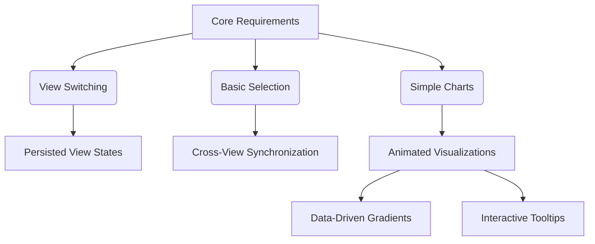

# **Clinical Trial Similarity Viewer** 🔬  
*A powerful platform for analyzing clinical trial similarity data.*

  
*Example dashboard view*

  
*Example ListView*

---

## **📌 Overview**  
The **Clinical Trial Similarity Viewer** is a full-stack web application designed to help researchers compare clinical trials based on key attributes like **trial designs, eligibility criteria, and outcomes**.  

With **interactive data visualization, real-time updates, and smart filtering**, users can efficiently explore trial similarities across multiple views.  

### ✨ **Why This Matters**  
Clinical trials generate vast amounts of data, but comparing trial characteristics manually can be **time-consuming** and **inaccurate**. This application simplifies that process using structured analytics.

---

## **🚀 Features**  
### **📊 Multi-view exploration**  
- **📋 List View:** Sortable, paginated tables for data exploration.  
- **📊 Dashboard View:** Interactive charts and geographic maps.  
- **🔢 Score View (Upcoming):** A similarity scoring system for deeper insights.  

### **🤖 Smart interactions**  
- Multi-select trials across different views.  
- Persistent view settings saved in `localStorage`.  
- Tooltips & error messages for improved user experience.  
- **Responsive UI** optimized for both desktop & mobile screens.  

### **📊 Advanced Data Visualization**  
- **Animated chart transitions** for fluid updates.  
- **Gradient-filled bar charts** for improved readability.  
- **Custom doughnut overlays** for detailed comparisons.  
- **Dynamic binning logic** for eligibility data categorization.  
- **Sponsor logo integration** with fallback UI when logos are missing.  

---

## **🛠 Tech Stack**  
### **Frontend**  
  
  
  

### **Backend**  
  
  

### **Visualization**  
  
  

---

## **🏗 Architecture Overview**  
### **🔹 State Management**  
- **Redux Toolkit** for centralized application state.  
- **Memoized selectors** to prevent unnecessary recomputations.  
- **Local storage integration** for persisting selections.  

### **🔹 Key Components**  
```
frontend/
├── src/
│   ├── features/         # Redux slices & state logic
│   ├── services/         # API calls & backend requests
│   ├── utils/            # Data processing helpers
│   ├── components/       # Reusable UI elements (buttons, cards, dropdowns)
│   └── pages/            # Main application views (Dashboard, ListView)
```

---

## **📥 Installation & Setup**  
### **1️⃣ Clone the Repository**  
```bash
git clone https://github.com/ChandanDev27/Clinical-Trial-Similarity-Viewer
cd clinical-trial-viewer
```
### **2️⃣ Install Dependencies**  
```bash
cd frontend && npm install
cd backend && npm install
```
### **3️⃣ Start Development Servers**  
```bash
# Backend (from root)
npm run dev

# Frontend (from /frontend)
cd frontend
npm start
```
### **4️⃣ Access the App**  
Open your browser and visit:  
🔗 **http://localhost:3000**

---

## **🌐 API Endpoints**  
The backend exposes RESTful APIs for interacting with clinical trial data. Below are key API endpoints with descriptions and example responses.

| **Endpoint**             | **Method** | **Description**                   | **Example Response**           |
|------------------------- |------------|---------------------------------  |--------------------------------|
| `/api/trials`            | `GET`      | Fetch a paginated trial list      | `{ "trials": [...] }`          |
| `/api/trials/selections` | `POST`     | Save selected trials              | `{ "success": true }`          |
| `/api/trials/dashboard`  | `GET`      | Aggregated dashboard metrics      | `{ "phases": [...] }`          |
| `/api/trials/filters`    | `GET`      | Retrieve available filter options | `{ "phases": [...] }`          |

### **Example API Request**  
Fetching paginated trial data:
```js
fetch('/api/trials?page=2&limit=10')
  .then(response => response.json())
  .then(data => console.log(data));
```

---

## **📈 Technical Enhancements**  


---

## **⚡ Quality-of-Life Improvements**  
### **🔹 Smart Pagination**  
✔️ Dynamic items-per-page selection  
✔️ Ellipsis-based page navigation  
✔️ Real-time total item counter  

### **🔹 Accessibility Enhancements**  
✔️ ARIA labels for all charts  
✔️ Keyboard-navigable tables  
✔️ Optimized contrast ratios  

### **🔹 Performance Optimizations**  
✔️ Lazy-loaded components for fast rendering  
✔️ Chart data memoization to avoid redundant calculations  
✔️ Debounced API calls to reduce network congestion  

---

## **🧪 Testing Infrastructure**  
### ✅ Modular Testing for:  
- **Eligibility distribution charts** validation.  
- **Phase analysis visualization** unit tests.  
- **Regional map rendering** consistency checks.  
- **Trial results breakdown** edge case handling.  

---

## **🎨 Design Choices**  
### **🔹 Component-First Architecture**  
- Modular UI components with **PropTypes validation**.  

### **🔹 Responsive Design**  
- **Tailwind CSS** utilities for mobile optimization.  

### **🔹 Accessibility Focus**  
- **ARIA labels** for improved usability.  
- **Keyboard support** for effortless navigation.  

### **🔹 Visual Consistency**  
- Unified **color system & typography standards**.  

---

## **🚀 Future Enhancements**  
✔️ **Trial similarity Score View**  
✔️ **CSV export functionality**  
✔️ **Enhanced map clustering**  
✔️ **User authentication system**  

---

## **💡 Contribution & Feedback**  
We welcome contributions! If you find issues or have ideas for improvements:  
- Submit a **pull request**.  
- Open an **issue** in GitHub.  
- Join our discussions for ideas and collaboration.  

🌍 *Help refine clinical trial research!* 🚀🔥  
